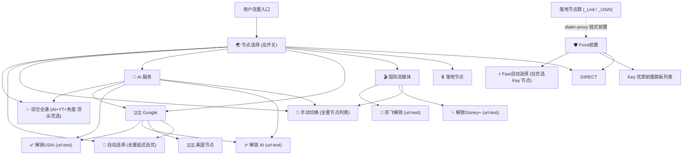

# Clash / Mihomo 配置渲染规范 (同步 freenode 规则体系)

本文档详述如何将经由服务测试筛选、重命名打标后的代理节点安全注入到母版模版（`template.yaml`）中，生成高可用、防泄露、具备 Key 优质前置分流的最终 Clash / Mihomo 配置文件。

---

## 1. 策略组结构 (Proxy Groups Hierarchy)

导出的配置继承 `template.yaml` 的基础框架，并基于实测打标结果自动构建以下专业分流策略组：



---

## 2. 策略组成员分配规则

1. **`🛡️ Front前置` 与 `⚡ Fast自动选择`**：
   - 专为落地节点提供第一跳（Jump Host）中转能力。
   - **`🛡️ Front前置`**：成员固定为 `["⚡ Fast自动选择", "DIRECT"] + [所有 Key 节点]`。
   - **`⚡ Fast自动选择`**：`url-test` 自动测优，优先通过测速与协议准入的 Key；无 Key 时使用下述备用池。
   - **绝不允许落地节点充当跳板**：任何标记为 `_Lnd`、`_USAI` 或带有 `dialer-proxy` 的节点严禁进入前置组。
   - 未评出 Key 但 `probe_services.py` 选出了备用前置（测速未被淘汰的可前置节点，即实际用于验证落地节点的前置）时，`⚡ Fast自动选择` 与 `🛡️ Front前置` 使用备用前置；再无则退守为可用直连节点或 `DIRECT`。
2. **`✅ 解锁 AI` 与 `✅ 解锁USAI`**：
   - `✅ 解锁 AI`：由所有带 `❇️`（AI三大全通）的节点组成，执行低延迟自动选优。
   - `✅ 解锁USAI`：仅由归属美国（`US`）且带 `_USAI`（AI三大全通的美国落地节点）组成。
   - 若无可达节点，自动回落至 `🚀 自动选择`。
3. **`🎬 国际流媒体`（奈飞与迪士尼）**：
   - `🎥 奈飞解锁`：由带 `_NF` 的节点组成，针对 `https://www.netflix.com/title/81280792` 自动测优。
   - `✨ 解锁Disney+`：由带 `_D+` 的节点组成，针对 `https://www.disneyplus.com` 自动测优。
4. **`🔒️ 落地节点`**：
   - 汇总所有标记为落地（`_is_landing`、`_Lnd`、`_USAI` 或带有 `dialer-proxy`）的节点。

---

## 3. 落地节点链式跳板注入 (Dialer-Proxy)

对于所有落地节点，渲染器会自动设置链式前置字段：
- Clash/Mihomo 设置 `dialer-proxy`，sing-box 设置 `detour`，均指向 `🛡️ Front前置` 策略组（原有 `detour` 可能指向不存在的出站，一律先剥离再注入）；
- 若直连前置发生变动或测速后动态调度，落地节点统一通过 `🛡️ Front前置` 建立连接；
- 直连节点自动剔除任何 `dialer-proxy` / `detour` 属性，杜绝循环前置引用。
- 流水线汇总会核对最终保留前置与实测链路：唯一验证过的前置已淘汰时，该落地不导出，不能仅因配置语法合法就声称链路可用。
- 中国排在所有已知国家/地区之后，未知最后；同地区落地沉底。该顺序同时用于 JSON、YAML 与报告，默认仍保留原编号。

---

## 4. 国际流媒体分流规则注入

母版已有 `🎬 国际流媒体` 分流时原样使用；没有时渲染器补上标准流媒体规则（插在首条 TikTok/YouTube/OpenAI 规则前，没有则插在 `MATCH` 兜底前），其中 `RULE-SET` 只补母版 `rule-providers` 已定义的规则集：
```yaml
rules:
  # 国际流媒体专属域名与规则集
  - DOMAIN-SUFFIX,netflix.com,🎬 国际流媒体
  - DOMAIN-SUFFIX,netflix.net,🎬 国际流媒体
  - DOMAIN-SUFFIX,nflxso.net,🎬 国际流媒体
  - DOMAIN-SUFFIX,nflxext.com,🎬 国际流媒体
  - DOMAIN-SUFFIX,nflxvideo.net,🎬 国际流媒体
  - DOMAIN-SUFFIX,nflximg.net,🎬 国际流媒体
  - DOMAIN-SUFFIX,disneyplus.com,🎬 国际流媒体
  - DOMAIN-SUFFIX,bamgrid.com,🎬 国际流媒体
  - DOMAIN-SUFFIX,disney-plus.net,🎬 国际流媒体
  - DOMAIN-SUFFIX,spotify.com,🎬 国际流媒体
  - DOMAIN-SUFFIX,scdn.co,🎬 国际流媒体
  - RULE-SET,Netflix,🎬 国际流媒体
  - RULE-SET,DisneyPlus,🎬 国际流媒体
  - RULE-SET,Spotify,🎬 国际流媒体
  - RULE-SET,Amazon,🎬 国际流媒体
  - RULE-SET,Hulu,🎬 国际流媒体
  - RULE-SET,HBO,🎬 国际流媒体
```

---

## 5. 母版维护与原文渲染

- **母版位置**：技能母版 `templates/template.yaml`（格式与 `freenode/template.yaml` 对齐），用户可直接手动修改；`--template` 可临时指定其它母版。
- **原文渲染**：导出时只把母版中的 `proxies` / `proxy-groups` 两段替换为生成内容，其余段落的注释、空行、缩进与顺序逐字保留。这两段在母版中可写成 `proxies: []`（行尾可带注释）、残留旧节点或整段删除（删除时插到 `rules:` 之前）；母版中手写的策略组会被脚本生成的 17 个标准策略组覆盖。
- **手动改母版的约定**：自定义规则按现有写法一行一条 `- 类型,内容,策略`，指向脚本生成的策略组、`DIRECT`/`REJECT` 等内置策略；`RULE-SET` 引用的名称须在 `rule-providers` 中定义。兼容 UTF-8 BOM 与 CRLF。
- **测试前校验**：`probe_services.py`（指定 `--output` 时）与 `probe_singbox.py` 在测试开始前先解析母版，YAML 语法错误报出行列号，规则指向不存在的策略组、缺少策略或引用未定义规则集时列出全部问题并退出，不会等整轮测试结束才失败。导出时再按实际节点与策略组复查一次。
- **一致性保证**：原文渲染结果必须解析回与目标配置完全一致；母版写法无法逐行保留时（如 `rules` 写成单行流式列表）改为整体输出并打印提示，不静默丢失格式。多个策略组共用节点列表时逐组展开，不输出 `&id001` 锚点。

## 6. 语法校验与导出验证

输出文件采用 UTF-8 编码无 BOM，导出后可通过以下命令进行语法和配置验证（首次运行需 GeoSite/GeoIP 数据，可从本机客户端数据目录复制到 `-d` 目录）：
```bash
mihomo -t -d <数据目录> -f <导出的配置.yaml>
```
确保无孤立策略组、无循环引用、无无效节点名。
