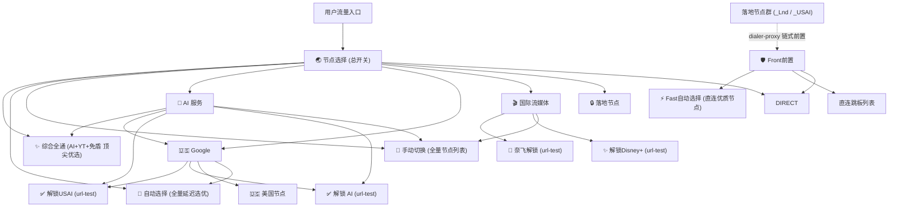

# Clash / Mihomo 配置渲染规范

本文档详述如何将经由服务测试筛选、重命名打标后的代理节点安全注入到母版模版（`template.yaml`）中，生成高可用、防泄露的最终 Clash / Mihomo 配置文件。

---

## 1. 策略组结构 (Proxy Groups Hierarchy)

导出的配置继承 `template.yaml` 的基础框架，并基于实测打标结果自动构建以下专业分流策略组：



---

## 2. 策略组成员分配规则

1. **`🛡️ Front前置` 与 `⚡ Fast自动选择`**：
   - 专为落地节点提供前置中转跳板。
   - 仅接纳直连前置节点，**绝不允许落地节点充当跳板**。
   - 当无可用直连节点时，自动回落为 `DIRECT`。
2. **`✅ 解锁 AI` 与 `✅ 解锁USAI`**：
   - `✅ 解锁 AI`：由所有带 `❇️`（AI三大全通）的节点组成，执行低延迟自动选优。
   - `✅ 解锁USAI`：仅由归属美国（`US`）且带 `_USAI`（AI三大全通的美国落地节点）组成。
   - 若无可达节点，自动回落至 `🚀 自动选择`。
3. **`🎬 国际流媒体`（奈飞与迪士尼）**：
   - `🎥 奈飞解锁`：由带 `_NF` 的节点组成，针对 `https://www.netflix.com/title/81280792` 自动测优。
   - `✨ 解锁Disney+`：由带 `_D+` 的节点组成，针对 `https://www.disneyplus.com` 自动测优。
4. **`🔒️ 落地节点`**：
   - 汇总所有标记为落地（`_is_landing`、`_Lnd`、`_USAI` 或带有 dialer-proxy）的节点。

---

## 3. 落地节点链式跳板注入 (Dialer-Proxy)

对于所有落地节点，渲染器会自动设置 `dialer-proxy` 字段：
- 默认指向 `🛡️ Front前置` 策略组；
- 若指定了固定前置节点名称，且该前置节点确实存在于本批次直连节点中，则指向该固定前置；
- 若为直连节点，则移除任何 `dialer-proxy` 字段。

---

## 4. 国际流媒体分流规则注入

渲染器会在母版规则的流媒体段自动注入标准流媒体规则集（防漏网）：
```yaml
rules:
  # 国际流媒体专属域名与规则集
  - DOMAIN-SUFFIX,netflix.com,🎬 国际流媒体
  - DOMAIN-SUFFIX,netflix.net,🎬 国际流媒体
  - DOMAIN-SUFFIX,nflxso.net,🎬 国际流媒体
  - DOMAIN-SUFFIX,nflxext.com,🎬 国际流媒体
  - DOMAIN-SUFFIX,nflxvideo.net,🎬 国际流媒体
  - DOMAIN-SUFFIX,nflximg.net,🎬 国际流媒体
  - DOMAIN-SUFFIX,disneyplus.com,🎬 国际流媒体
  - DOMAIN-SUFFIX,bamgrid.com,🎬 国际流媒体
  - DOMAIN-SUFFIX,disney-plus.net,🎬 国际流媒体
  - DOMAIN-SUFFIX,spotify.com,🎬 国际流媒体
  - DOMAIN-SUFFIX,scdn.co,🎬 国际流媒体
  - RULE-SET,Netflix,🎬 国际流媒体
  - RULE-SET,DisneyPlus,🎬 国际流媒体
  - RULE-SET,Spotify,🎬 国际流媒体
  - RULE-SET,Amazon,🎬 国际流媒体
  - RULE-SET,Hulu,🎬 国际流媒体
  - RULE-SET,HBO,🎬 国际流媒体
```

---

## 5. 校验与导出

输出文件采用 UTF-8 编码无 BOM，导出后可通过以下命令进行语法和配置验证：
```bash
mihomo -t -f <导出的配置.yaml>
```
确保无孤立策略组、无循环引用、无无效节点名。
